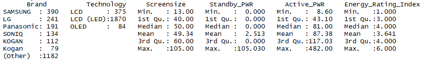
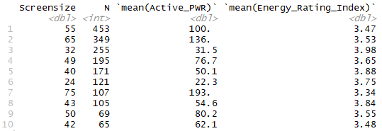
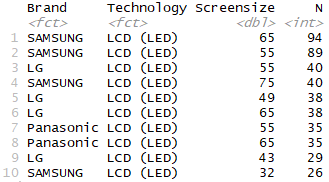

Abstract
========

Television suppliers must register television appliances, which are to be sold
in Australia and New Zealand, with the Australian government. The preferred
attributes of the registered television appliances such as screen size, power
consumption and technology (e.g. LCD, Plasma, OLED, etc.) plays an important
role in deciding which combination of attributes are favorable for the
Australian and New Zealand consumers. The purpose of this report is to
investigate the relationship between the physical attribute of television
appliances (screen size, power consumption and technology) and their associated
energy ratings. The dataset used in the analyses, as obtained from the
Australian government, contains all the television appliances registered between
April 2013 to January 2018 for sale in Australia and New Zealand. This dataset
was processed, interpreted, analyzed and visualized utilizing the R analytical
programming language. This report sheds light on the preferred combination of
attributes (screen size, technology, power consumption and energy rating index)
of the television appliances that are registered by the suppliers. The report
also highlights an interesting relationship between power consumption and energy
rating index. This report may influence the way consumers decide to choose
between television appliances based on information and insight that are
contained in the report.

*Keywords*: Analysis, R, Energy Rating Index, Screen size, Power consumption,
Brand, Television Appliance

Introduction
============

According to ACMA [1], twenty nine percent of households had purchased a new
television set in the 12 months before the *ACMA media release 46/2012 - 20
June* study, and 70 per cent had bought a new set in the three years prior to
the study. With the advent of new television technologies such as LCD, Plasma,
OLED and LCD (LED), increased screen sizes and various smart TV capabilities, it
has become difficult for the average consumer to understand where the cost
benefits are for the new television appliances. There seem to be a general
misconception amongst consumers as to how different television appliances that
consists of different attributes relates to price and energy ratings. Consumers
seems to think that there is a linear correlation between television appliances
power consumption and their associated energy index ratings. It is this latter
aspect that has motivated me to find out what the true relationship is between
the various attributes of television appliances, especially the relationship
between power consumption, screen size, technology and energy ratings.

Data
====

All suppliers are obligated by law to register household appliances, which are
to be sold in Australia and New Zealand, with the Australian government. The
data for these registered household appliances is made available by the
Australian Government [2]. These datasets are regularly updated by the
Australian Government but, for this report a specific registered, **television
appliances** dataset was downloaded from the URL as specified in [3]. The
datafile is in **csv** (comma-separated-variable) file format. The dataset
contains 3381 entries of registered television appliances. A total number of 31
variables are captured per record of which 19 are of type Factor (17 – Categoric
Nominal, 2 - Date), 12 of type Numerical (11 – Numeric,1 - Integer). There was
no prior intervention on the dataset and the dataset was utilized and consumed
as downloaded.

Methods
-------

The R-Studio software application (Version: 1.1.383) was used to download and
process the television appliance dataset. Functions from the *cluster,
tidyverse* and *dplyr* libraries were utilized to explore, analyze, evaluate,
filter, tidy, transform, summarize and visualize the dataset. Of the 31
available variables only 6 variables, as listed in [A1] (4 of type Numerical and
2 of type Categoric - Nominal), were deemed necessary for the analysis process.
The rest of the variables were discarded. The screen size variable was converted
from centimeters (as measured diagonally) to inches - this falls more in line
with consumer understanding of television screen sizes. The technology variable
has 4 possible values: Plasma, LCD, LCD (LED) and OLED. These values are treated
as nominal. The SRI (Star Rating Index) variable was rescaled to a value in the
range [1:6], which corresponds to the consumer industry star rating standard.
Unnecessarily long brand names were shortened to be better displayed in ggplot2
visualizations. All records containing empty values were discarded. The numeric
variables Active Power and Standby Power were rounded to two decimal points. A
total of 3115 records remained after the original dataset was filtered and
missing value records were imputed. See **A – R Code** for associated R code
listings.

A summary of the dataset is listed in [A2]. A Gower’s dissimilarity matrix was
created and then a heatmap was generated from that. The generated heatmap [A3]
revealed some interesting clusters, which probably points to the demarcation
boundaries between certain technology types of the registered televisions.

Group based data summarization are listed in [A4] and [A5]. The *select*
function in base R as well as the *groupby* and *arrange* functions from the
*dplyr* library were used to filter, group and arrange the dataset in these
summarizations. Lastly, *ggplot* was used to create visual presentations
(scatter plots, box plot and line plots) of the following variables: Screen size
vs. Active Power, Screen size vs. Energy Rating Index and Technology vs. Energy
Rating Index. The scatterplots were overlaid with line plots, which were derived
as linear regression models. The *lm* function in base R was utilized for the
regression models.

Results and Discussion
----------------------

A summary of the dataset [A2] reveals that LG, Samsung and Panasonic are the
three suppliers who registered the greatest number of television appliances,
i.e. a total of 1161. Of the four registered technologies, the LCD (LED)
technology was by far the leading technology for registered television
appliances with a total of 2656. The average screen size was 46.2 inches, the
average active power consumption was 75.96 Watts and the average energy rating
was 3.72.

The heatmaps for the dataset [A3] illustrates some interesting clusters and
probably coincide with the different technologies and screen sizes. The
group-based summarization in [A4] indicates that the 55-inch screen size was the
top screen size registered with a total of 539. Interestingly, the 65-inch
screen size was the third most registered screen size after the 32-inch. Due to
the popularity of the 65-inch screen size one would think that the 60-inch
screen size should be equally sought after but, the 60-inch screen size
appliances ranks only 8th with a total of 109 appliances registered. The
group-based summarization in [A5] indicates that the LCD (LED) is overwhelmingly
popular as a technology with Samsung and LG dominating the registration list
with their 55-inch, 32-inch and 65-inch LCD (LED) appliances.

The scatterplot in [A6] illustrates the direct linear relationship between
screen size and active power consumption. This is to be expected, as more pixels
obviously requires more power. This trend holds true for all 4 technologies. The
scatterplot in [A7] suggest a very weak linear inverse relationship between
screen size and energy rating index. One would expect that energy efficiency
drops linearly for increasing screen sizes because, more pixels consumes more
energy. However, the scatterplots in [A6] and [A7] suggests otherwise. The
scatterplot in [A7] also indicates that there are a wide range of screen sizes
registered for each energy rating index.

Lastly, the boxplot in [A8] illustrates the different technologies vs. energy
rating index. From the plot one can deduce that both LCD and LCD (LED)
technologies have, on average, a higher energy rating index and therefore are
more energy efficient technologies.

Conclusion
----------

The disparity that is illustrated between the scatterplots in [A6] and [A7]
correlates well with the advice given by Australian government’s Energy Rating
website, under the section *The Energy Rating Label on Television* [4]. This
means that the energy rating star system is meant to be used to compare
television appliances of the same screen size. E.g. when a consumer chooses
between two 55-inch screens, which both have the same attributes but, the one
has an energy star rating of 5 and the other has an energy star rating of 3.
Then, the consumer should choose the one with the energy star rating of 5, as
this one would be the more energy efficient 55-inch appliance. This is how the
energy star rating system is meant to work. Therefore, the opposite then holds
true – a consumer cannot use the energy star rating index to compare a 32-inch
LCD screen with an energy star rating index of 3 stars, with a 65-inch LCD
television with an energy star rating index of 5 stars. By design, there is no
possible way for a 65-inch LCD screen to consume less power than a 32-inch LCD
screen. Furthermore, from the results it is obvious that suppliers are
registering an overwhelmingly higher number LCD (LED) technology driven
television appliances with screen sizes of 55-inches. To the consumer, this
should be a clear indication that the greatest price competition point will be
on this joint front. Therefore, the average consumer will most likely find the
best value for money by looking at 55-inch LCD (LED) television appliances.
Then, lastly, the consumer can compare the energy ratings the 55-inch LCD (LED)
appliances to find the one which is most power efficient. Both those criteria
could enable the consumer to find good value for money in terms of technology,
screen size and power consumption.

Appendix 1
==========

Table - Selected variables from original dataset

| **Variable**   | **Type**            | **Description**                                                                   |
|----------------|---------------------|-----------------------------------------------------------------------------------|
| Brand_Reg      | Categoric - Nominal | This is the manufacturers brand                                                   |
| screensize     | Numerical           | The diagonal measurement of the screen in cm                                      |
| Screen_Tech    | Categoric - Nominal | This is the type of screen technology (LCD, Plasma, OLED, etc…)                   |
| Act_stnd_power | Numerical           | This is the time allocated that the television will be in active standby mode.    |
| Avg_mode_power | Numerical           | This is the amount of energy used by the appliance when the television is in use. |
| SRI            | Numerical           | The current Star Rating Index for the appliance.                                  |

Appendix 2
==========

```
summary(Data_2)
```

Table - Summary of cleansed dataset



Appendix 3
==========

```
Dist \<- daisy(Data_2, metric = "gower")

Dist \<- as.matrix(Dist)

dim \<- ncol(Dist) \# used to define axis in image

heatmap(Dist, Rowv=TRUE, Colv="Rowv", symm = TRUE)
```

Figure – Generated Heatmap


----------------------------------------

Appendix 4
==========

```
Data_2 %\>%

group_by(Screensize) %\>%

summarise(N = n(), mean(Active_PWR), mean(Energy_Rating_Index)) %\>%

arrange(desc(N)) %\>%

head(10)
```

Table – Top 10 screen sizes registered



Appendix 5
==========

```
Data_2 %\>%

group_by(Brand, Technology, Screensize) %\>%

summarise(N = n()) %\>%

arrange(desc(N)) %\>%

head(10)
```

Table – Top 10 brands registered technologies by screen size



Appendix 6
==========

```
ggplot(data = Data_2) + geom_point(mapping = aes(x = Screensize, y = Active_PWR,
color = Technology)) + geom_smooth(mapping = aes(x = Screensize, y = Active_PWR,
color = Technology), method = "lm", se = FALSE) + xlab("Screensize (diagonal -
inches)") +

ylab("Active Power(W)") + ggtitle("Scatterplot - Screensize vs. Active Power ")
```

Figure – Screen size (inches) vs. Active Power (W)



Appendix 7
==========

```
ggplot(data = Data_2) + geom_point(mapping = aes(x = Screensize, y =
Energy_Rating_Index, color = Technology)) + geom_smooth(mapping = aes(x =
Screensize, y = Energy_Rating_Index, color = Technology), method = "lm", se =
FALSE) + xlab("Screensize (diagonal - inches)") +

ylab("Energy Rating Index") + ggtitle("Scatterplot - Screensize vs. Energy
Rating Index ")
```

Figure – Screen size (inches) vs. Energy Rating Index (1:6)



Appendix 8
==========

```
ggplot(data = Data_2, mapping = aes(x = Technology, y = Energy_Rating_Index)) +

geom_boxplot(outlier.color = "red", outlier.shape = 3) + geom_jitter(width =
0.1, alpha = 0.05, color = "blue") + xlab("Technology") + ylab("Energy Rating
Index") +

ggtitle("Boxplot - Technology vs. Energy Rating Index")
```



References
==========

1. ACMA. 2018. Bigger, better, cheaper: Australian households embrace digital TVs. [ONLINE] Available at: https://www.acma.gov.au/theACMA/acma-media-release-462012-20-june-bigger-better-cheaper-australian-households-embrace-digital-tvs. [Accessed 15 February 2018].

2. Data.gov.au. 2018. Energy Rating Data for household appliances – Labelled Products. [ONLINE] Available at: https://data.gov.au/dataset/energy-rating-for-household-appliances. [Accessed 15 February 2018].

3. Data.gov.au. 2018. NA. [ONLINE] Available at: https://data.gov.au/dataset/559708e5-480e-4f94-8429-c49571e82761/resource/93a615e5-935e-4713-a4b0-379e3f6dedc9/download/tmpvhqhjztv20180202.csv. [Accessed 15 February 2018].

4. Energy Rating. 2018. http://www.energyrating.gov.au/products/televisions. [ONLINE] Available at: http://www.energyrating.gov.au/products/televisions. [Accessed 15 February 2018].











